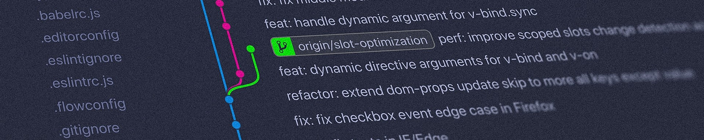

# 

## About Me

👋 Hi, I’m @DaveyJH. A Junior Software Developer, residing in the South West of
the UK.

I am currently learning with [Code Institute](https://www.codeinstitute.net) and
progressing toward a Diploma in Full Stack Software Development. I hope to find
my feet and embark on a career in the software development industry.

Originally trained as a mechanic and vehicle diagnostic expert, I developed a
strong background in problem-solving and logical fault-finding. Spending a few
years working with IP video surveillance, addressable fire alarm systems and
various other HID systems gave me a great insight into flow control, cause and
effect programming and a thorough approach to system design.

👀 I’m interested in ... Coding!

I decided to retrain in the software development industry during 2021. I hope to
develop a broad knowledge base and widen my understanding of languages. I intend
to bring expertise in problem-solving and to create innovative solutions.

## GitHub statistics


🌱 I’m currently learning ...

- *C#*
- *JQuery*
- *Flask*

:computer: Languages I am comfortable working with are...

```python
def print_language(lang):
    """Shows a language I am comfortable with
    
    ---
    Args:
        lang (str): the language to be printed, capitalizes first letter

    Returns:
      None
    """

    print(lang.title())


>>>print_language("python")
Python
```

```JavaScript
/**
 * Shows a language I am comfortable with
 * @param {string} lang - the language to be printed, capitalizes as needed
 * @returns {void}
 */
function printLanguage(lang) {
  console.log(`${lang[0].toUpperCase()}${lang.slice(1, lang.indexOf("s"))
    }${lang.slice(lang.indexOf("s")).charAt(0).toUpperCase()
    }${lang.substring(lang.length - 5).toLowerCase()}`);
}

printLanguage("javascrIPT"); // JavaScript

```

```html
<!DOCTYPE html>
<html lang="en">
  <head>
    <meta charset="UTF-8">
    <meta http-equiv="X-UA-Compatible" content="IE=edge">
    <meta name="viewport" content="width=device-width, initial-scale=1.0">
    <title>HTML</title>
  </head>
  <body>
    <!-- Shows a language I am comfortable with -->
    <h1>HTML<h1>
  </body>
</html>
```

```css
  /* Shows a language I am conmfortable with */
:root {
  --rPurple: #663399;
}

body:before {
  content: "CSS";
  font-size: 2rem;
  font-family: Arial, Helvetica, sans-serif;
  text-decoration: underline overline dashed rgba(102,51,153,.8) 2px;
  color: var(--rPurple);
  background-color: #eaeaea;
}
```

💞️ I’m looking to collaborate on ... N/A (For now!)

*I have a few ideas for the future, but I am focussing on improving my skill set
for now!*

**[Curriculum Vitae](./djhorrocks-cv.pdf)**

## Contact Me

If you have found something through my portfolio which really piques
your curiosity, **don't hesitate to get in touch:**

[](https://www.linkedin.com/in/davejhorrocks/)

*Thanks to [@Abibubble](https://github.com/Abibubble) for the README styling idea!*
:nerd_face:
